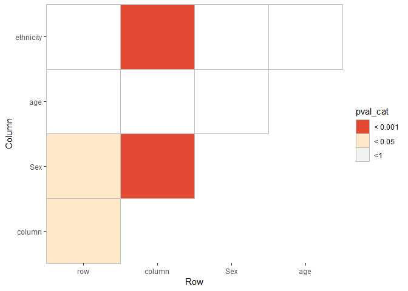

yahew
=====

This is my collection of tools for DNA methylation analysis.

### Install

    library(devtools)
    install_github('wvictor14/yahew')

    library(plyr)
    library(tidyr)
    library(dplyr)
    library(ggplot2)
    library(minfiData)
    library(yahew)

### lmmatrix

Computes pairwise linear models between several variables.

    # load example data
    data(RGsetEx)

    # calculate pcs on the data
    betas <- getBeta(RGsetEx)
    pc_obj <- prcomp(t(na.omit(betas)), center = T, scale = T)
    rotated <- pc_obj$x

    #rsquared
    rsq <- lmmatrix(dep = rotated,
                    ind = as.data.frame(pData(RGsetEx)[,c('Sample_Group', 'age', 'sex', 'status')]))

    #pvalue
    pva <- lmmatrix(dep = rotated,
                    ind = as.data.frame(pData(RGsetEx)[,c('Sample_Group', 'age', 'sex', 'status')]),
                    metric = 'Pvalue')
    ##### plot
    # reshape first
    rsq_plot <- rsq %>% as.data.frame() %>% 
      
      # add dep variables
      mutate(dep = rownames(rsq)) %>%
      
      # reshape
      gather(PC, rsquared, -dep)

    pva_plot <- pva %>% as.data.frame() %>% 
      
      # add dep variables
      mutate(dep = rownames(rsq)) %>%
      
      # reshape
      gather(PC, pval, -dep) %>%
      
      # pvalue categories
      mutate(pval_cat = case_when(
        pval > 0.05  ~ '> 0.05',
        pval < 0.05 & pval > 0.01 ~ '< 0.05',
        pval < 0.01 & pval > 0.001 ~ '< 0.01',
        pval < 0.001 ~ '< 0.001'
      ))
      
    ggplot(rsq_plot, aes(x = PC, y = dep, fill = rsquared)) +
      geom_tile() + theme_bw() +
      scale_x_discrete(expand = c(0, 0)) +
      scale_y_discrete(expand = c(0, 0)) +
      scale_fill_gradientn(colours=c("white", "#ffffcc", "#41b6c4", "#2c7fb8", "#253494"), 
                           breaks = c(0,0.5,1), limits = c(0,1), 
                           guide = guide_colorbar(frame.colour = "black", ticks.colour = "black")) 

    ggplot(pva_plot, aes(x = PC, y = dep, fill = pval_cat)) +
      geom_tile() + theme_bw() +
      scale_x_discrete(expand = c(0, 0)) +
      scale_y_discrete(expand = c(0, 0)) +
      scale_fill_manual(values = c('> 0.05' = 'white', '< 0.05' = '#fee8c8', 
                                   '< 0.01' = '#fdbb84', '< 0.001' = '#e34a33'))

### pairTest

To test if covariates are confounding each other, we need to pairwise
tests of independence between covariates. If at least one covariate is
numeric, we can use linear regression. Otherwise if both covariates are
categorical, then a chi squared test must be used.

    variables <- data.frame(
      row = c(1, 1, 2, 2, 3, 3),
      column = c(1, 1, 1, 2, 2, 2),
      Sex = c('m', 'm', 'm', 'f', 'f', 'f'),
      age = c(18, 19, 18, 27, 30, 16),
      ethnicity = c('AF', 'AF', 'AF', 'EU', 'EU', 'AS')
    )

    tests <- pairtest(variables)

    ## Warning in summary.lm(lm(as.formula(paste0(colnames(df)[x[1]], " ~ ",
    ## colnames(df[x[2]]))), : essentially perfect fit: summary may be unreliable

    ## Warning in summary.lm(lm(as.formula(paste0(colnames(df)[x[1]], " ~ ",
    ## colnames(df[x[2]]))), : essentially perfect fit: summary may be unreliable

    ## Warning in chisq.test(df[, x[1]], df[, x[2]]): Chi-squared approximation
    ## may be incorrect

    # make categories
    tests <- tests %>% 
      mutate(pval_cat = if_else(p.value < 0.001, '< 0.001',
                                if_else(p.value < 0.01, '< 0.01',
                                        if_else(p.value < 0.05, '< 0.05', '<1'))))
    tests

    ##    X1    Row    Column        Fstat df p.value Chi.Square pval_cat
    ## 1   1    row    column 8.000000e+00  4   0.047         NA   < 0.05
    ## 2   2    row       Sex 8.000000e+00  4   0.047         NA   < 0.05
    ## 3   3    row       age 5.660000e-01  4   0.494         NA       <1
    ## 4   4    row ethnicity 3.643000e+00  3   0.104         NA       <1
    ## 5   5 column       Sex 1.030218e+31  4   0.000         NA  < 0.001
    ## 6   6 column       age 1.976000e+00  4   0.233         NA       <1
    ## 7   7 column ethnicity 7.605904e+30  3   0.000         NA  < 0.001
    ## 8   8    Sex       age 1.976000e+00  4   0.233         NA       <1
    ## 9   9    Sex ethnicity           NA  2   0.050          6       <1
    ## 10 10    age ethnicity 4.591900e+01  3   0.221         NA       <1

    # plot heatmap of associations
    ggplot(tests, aes(x=Row, y = Column, fill = pval_cat)) +
      geom_tile(col = 'grey') + theme(panel.background = element_blank()) + 
      scale_x_discrete(expand = c(0, 0)) +
      scale_y_discrete(expand = c(0, 0)) +
      scale_fill_manual(values = c('> 0.05' = 'white', '< 0.05' = '#fee8c8', 
                                   '< 0.01' = '#fdbb84', '< 0.001' = '#e34a33'))

### makeSampleSheet

For creating a sample sheet out of sample IDs, we need a list of file
paths corresponding to each sample. `makeSampleSheet` takes a vector of
sample IDs and will find all associated idats and return their
corresponding file paths in a data frame along with other sample
variables present in the master sample sheet.

Basically searches the 'Sample\_Name' column for matches based on the
provided `samples` vector. Non- exact matches are tolerated, so for
example PM306 will return PM306 and PM306\_d.

    samples <- c('PM4', 'PM30', 'PM47', 'PM123', 'PM130', 'PM306')
    ss <- makeSampleSheet(samples)

    ## Joining, by = "file_name"

    ss

    ## # A tibble: 10 x 12
    ##    Sample_Name Sample_Well Sample_Plate Sample_Group Pool_ID Sentrix_ID
    ##    <chr>       <chr>       <chr>        <chr>        <lgl>        <dbl>
    ##  1 PM123       A05         WG0011624-M~ <NA>         NA         9.29e 9
    ##  2 PM130       D05         WG0011624-M~ <NA>         NA         9.27e 9
    ##  3 PM30        G01         WG0011624-M~ <NA>         NA         9.30e 9
    ##  4 PM306       C02         WG0022048-M~ PM306        NA         1.00e10
    ##  5 PM306_d     E03         WG0022048-M~ PM306_d      NA         1.00e10
    ##  6 PM306_v     E05         WG0022048-M~ PM306_v      NA         1.00e10
    ##  7 PM306r      F08         WG0022048-M~ PM306r       NA         1.00e10
    ##  8 PM306_r3    D06         WG0028730-M~ villi        NA         1.01e11
    ##  9 PM4         C06         WG0011624-M~ <NA>         NA         9.29e 9
    ## 10 PM47        D01         WG0011624-M~ <NA>         NA         9.27e 9
    ## # ... with 6 more variables: Sentrix_Position <chr>, Condition <chr>,
    ## #   Sex <chr>, GA <chr>, MA <dbl>, Basename <chr>

    rgset <- minfi::read.metharray.exp(targets = ss, verbose = T)

    ## [read.metharray] Reading 9285451059_R05C01_Grn.idat

    ## [read.metharray] Reading 9266441156_R05C01_Grn.idat

    ## [read.metharray] Reading 9296930123_R01C01_Grn.idat

    ## [read.metharray] Reading 10005833024_R02C01_Grn.idat

    ## [read.metharray] Reading 10005833038_R03C01_Grn.idat

    ## [read.metharray] Reading 10005833038_R05C01_Grn.idat

    ## [read.metharray] Reading 10005833110_R02C02_Grn.idat

    ## [read.metharray] Reading 100946200071_R06C01_Grn.idat

    ## [read.metharray] Reading 9285451020_R06C01_Grn.idat

    ## [read.metharray] Reading 9266441156_R01C01_Grn.idat

    ## [read.metharray] Reading 9285451059_R05C01_Red.idat

    ## [read.metharray] Reading 9266441156_R05C01_Red.idat

    ## [read.metharray] Reading 9296930123_R01C01_Red.idat

    ## [read.metharray] Reading 10005833024_R02C01_Red.idat

    ## [read.metharray] Reading 10005833038_R03C01_Red.idat

    ## [read.metharray] Reading 10005833038_R05C01_Red.idat

    ## [read.metharray] Reading 10005833110_R02C02_Red.idat

    ## [read.metharray] Reading 100946200071_R06C01_Red.idat

    ## [read.metharray] Reading 9285451020_R06C01_Red.idat

    ## [read.metharray] Reading 9266441156_R01C01_Red.idat

    ## [read.metharray] Read idat files in 6.2 seconds

    ## [read.metharray] Creating data matrices ... done in 8.6 seconds
    ## [read.metharray] Instantiating final object ... done in 0.0 seconds

    ## Warning: Setting row names on a tibble is deprecated.

    rgset

    ## class: RGChannelSet 
    ## dim: 622399 10 
    ## metadata(0):
    ## assays(2): Green Red
    ## rownames(622399): 10600313 10600322 ... 74810490 74810492
    ## rowData names(0):
    ## colnames(10): 9285451059_R05C01 9266441156_R05C01 ...
    ##   9285451020_R06C01 9266441156_R01C01
    ## colData names(13): Sample_Name Sample_Well ... Basename filenames
    ## Annotation
    ##   array: IlluminaHumanMethylation450k
    ##   annotation: ilmn12.hg19
